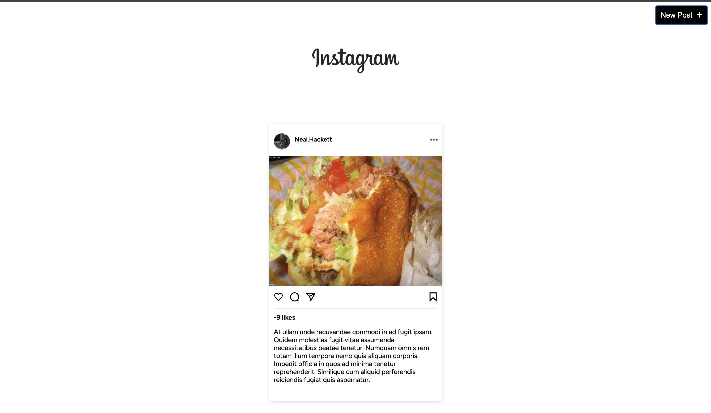
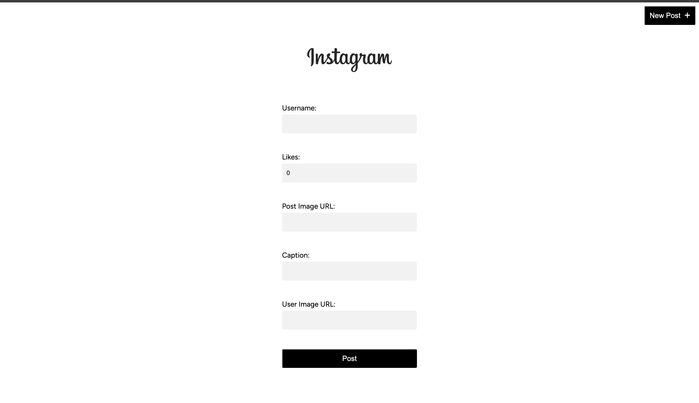

# Instagram Feed & Like Feature Web App

This **Vue.js** project replicates key features of Instagram, including a post feed with dynamic data, a like system, and a post creation page. The project demonstrates component-based architecture, API integration, and real-time interaction.

## Features

- **Post Feed Component**: Dynamically renders posts fetched from an API, including user images, captions, and like counts.
- **Like Functionality**: Users can interact with posts by clicking the like button, which updates the like count in real-time.
- **Create Post Page**: Users can create new posts with an image URL, caption, and initial like count.
- **Component-Based Design**: Built with reusable Vue components for modularity and scalability.

## Technologies Used

- **Vue.js**: Frontend framework for building the UI and handling user interactions.
- **MockAPI**: Used to simulate data persistence for posts and likes.
- **HTML5/CSS3**: For structuring and styling the app.
- **JavaScript (ES6+)**: Provides dynamic behavior for the app.

## Usage

- **View Feed**: The homepage fetches posts from the MockAPI and displays them in a feed format.
- **Create a Post**: Navigate to `/create-post` to add a new post with an image, caption, and like count.
- **Like Posts**: Users can like posts, with real-time updates to the like count.

## Future Enhancements

- **Responsive Design**: Implement mobile responsiveness to better simulate Instagram’s UI.
